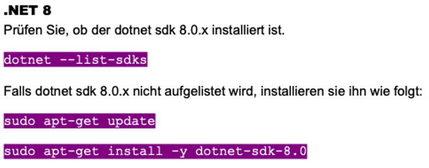
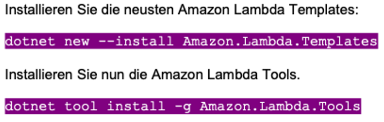
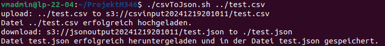
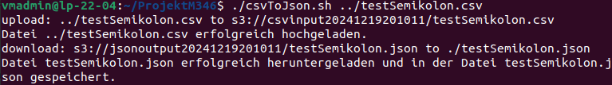
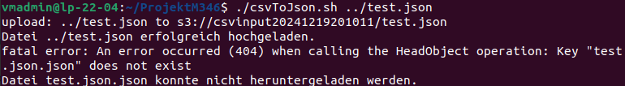
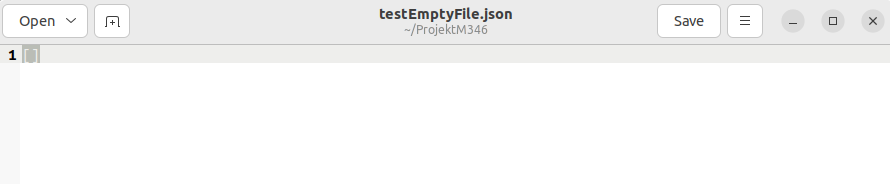
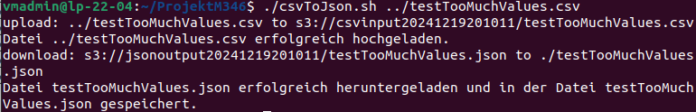
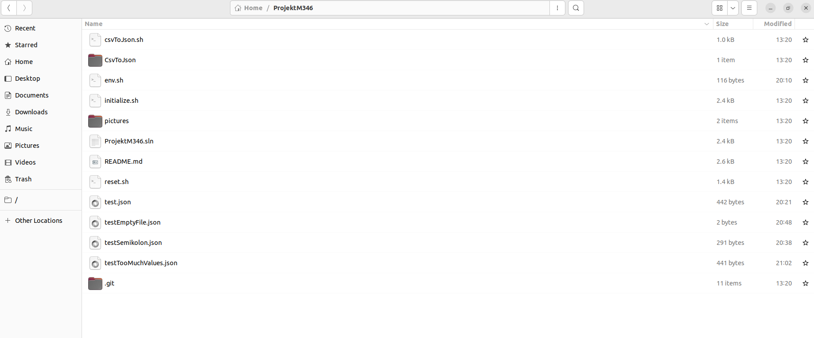

# Projekt M346

## CSV zu JSON Converter mit AWS Lambda

**Inhaltsverzeichnis**

- [Projekt Team](#projekt-team)
- [Einleitung zur Projektdokumentation](#einleitung-zur-projektdokumentation)
- [Vorbereitung](#vorbereitung)
- [Aufbau des Services](#aufbau-des-services)
- [Anwendung](#anwendung)
    - [Anforderungen](#anforderungen)
    - [Inbetriebnahme](#inbetriebnahme)
    - [Nutzung](#nutzung)
- [Test Protokoll](#test-protokoll)
    - [Normales CSV File](#normales-csv-file)
    - [CSV File mit anderen Delimitern](#csv-file-mit-anderen-delimitern)
    - [JSON File anstelle von CSV File](#json-file-anstelle-von-csv-file)
    - [Leeres CSV File](#leeres-csv-file)
    - [CSV File mit zu vielen Werten](#csv-file-mit-zu-vielen-werten)
    - [Speicherort der konvertierten Dateien](#speicherort-der-konvertierten-dateien)
- [Reflexion](#reflexion)
    - [Benjamin Nater](#benjamin-nater)
    - [Matteo Bucher](#matteo-bucher)
    - [Timo Aepli](#timo-aepli)
- [Quellenverzeichnis](#quellenverzeichnis)

## Projekt Team

- Timo Aepli
- Matteo Bucher
- Benjamin Nater

## Einleitung zur Projektdokumentation

In diesem Projekt haben wir, Timo Aepli, Matteo Bucher und Benjamin Nater, einen Cloud-Service entwickelt, der CSV-Dateien automatisch in JSON konvertiert. Mithilfe von AWS S3 und Lambda stellen wir die Lösung im AWS Learner Lab bereit. Alle Dateien sowie die gesamte Dokumentation, einschließlich Aufbau, Nutzung und Testergebnisse, haben wir in einem Git-Repository abgelegt.

## Vorbereitung

Zuerst haben wir ein öffentliches Git-Repository erstellt. Danach haben wir eine Aufgabenliste erstellt, in der festgelegt ist, wer was macht.

| Aufgabe | Erledigt bis | Wer | Verantwortlich |
| ----------- | ----------- | ----------- | ----------- |
| Lambda Funktion | 18.12.2024 | alle | Matteo, Benjamin |
| Buckets per Script erstellen CLI-Datei | 18.12.2024 | alle | Matteo, Benjamin |
| Dokumentation | 18.12.2024 | alle | Timo |
| Selbstreflektion | 19.12.2024 | alle | alle |
| Testen | 19.12.2024 | Timo | Timo |

## Aufbau des Services

Der Cloud-Service basiert auf drei Scripts und einem dotnet-Projekt. Durch den initialize Script wird das dotnet-Projekt als lambda-Funktion deployed und zwei s3 Buckets werden erstellt. Mit dem Script csvToJson kann der eigentliche Cloud-Service, die csv zu json Konvertierung genutzt werden. Über den reset Script können schlussendlich alle erstellten Instanzen im AWS Learner Lab wieder gelöscht werden.

Funktionsweise Initialize.sh
Im Initialize.sh werden als erstes eindeutige s3Bucketnamen und definiert den Namen der Lambda Funktion. Wenn diese Namen angepasst werden sollen, kann das in den ersten Zeilen des initialize.sh Files gemacht werden. BUCKET_NAME ist der input Bucket Name und BUCKET2_NAME ist der output Bucket Name. Der restliche Ablauf ist wie folgt:

- Region und Account ID von aws auslesen
- Prüfen ob ein Delimiter mitgegeben wurde (1. Parameter) und diesen zu einem Wort konvertieren
  - Der Standard-Delimiter ist Komma
  - Der Delimiter darf nicht als Zeichen gespeichert sein, da aws keine Variablenwerte mit Zeichen zulässt
- Die Namen der s3 Buckets und der Lambda Funktion im Environment File env.sh speichern, damit diese in anderen Scripts verfügbar sind
- Lambda Funktion deployen
- Umgebungsvariablen der Lambda Funktion konfigurieren
  - BUCKET2_NAME output Bucket, wird in der Lambda Funktion verwendet
  - CSV_DELIMITER Delimiter des csv Files, wird in der Lambda Funktion verwendet
- s3 Buckets erstellen
- Trigger berechtigung für den input s3 Bucket erstellen
- Trigger erstellen, bei einem csv-File upload in den input s3 Bucket wird die Lambda Funktion getriggert

Funktionsweise csvToJson.sh

- Variabeln aus dem env.sh auslesen
- Wenn keine csv-Datei als Parameter mitgegeben wurde (1. Parameter), wird der Pfad zu einer csv-Datei vom User angefordert
- File in den input s3 Bucket laden
- Mit dem Pfad den Dateinamen der konvertierten json Datei berechnen
- Json Datei vom output s3 Bucket herunterladen

Funktionsweise reset.sh

- Variabeln aus dem env.sh auslesen
- s3 Bucket Inhalt löschen
- s3 Bucket löschen
- Trigger berechtigung des input s3 Buckets löschen
- Lambda Funktion löschen
- env.sh löschen

Funktionsweise Lambda Funktion

- Output s3 Bucket und Delimiter aus den Umgebungsvariablen auslesen
- Delimiter von einem Wort zu einem Zeichen konvertieren
- Durch alle hochgeladenen csv's loopen
  - Input Bucket und hochgeladenes Element auslesen
  - Delimiter setzen
  - mit dem Csv-Helper die Csv Datei lesen und in ein Dictionary speichern
  - Dictionary zu einem Json string konvertieren
  - Json string in ein json File im output s3 Bucket speichern
  - Loggen, dass die Konvertierung erfolgreich war

## Anwendung

### Anforderungen

- **Unix-Betriebssystem**  
  Geeignet für Linux und macOS.  

- **AWS Learner Lab**  
  Deine Lernumgebung für Cloud-Technologien.  

- **AWS CLI**  
  [Installation und Konfiguration von AWS CLI](https://gbssg.gitlab.io/m346/iac-aws-cli/ "AWS CLI")  

- **.NET 8**  
    

- **AWS Lambda**  
    

---

### Inbetriebnahme

Folgende Befehle ausführen:

```
git clone https://github.com/TimoAepli/ProjektM346.git
cd ProjektM346
./initalize.sh
```


---

### Nutzung

Bei allen Befehlen wird davon ausgegangen, dass sich der Anwender im Ordner /ProjektM346 befindet.
Die Anwendung des Cloud-Services findet über den Script csvToJson statt.
Zum eine csv Datei konvertieren, kann der Pfad zu ihr als Parameter mitgegeben werden:

```
./csvToJson.sh "CSVPFAD"
```

Ansonsten wird im Verlauf des Scripts nach der zu konvertierenden Datei gefragt

```
./csvToJson.sh
```

Die Datei wird automatisch konvertiert und im Ordner /ProjektM346 als json Datei abgelegt
Beispiel:

```
./csvToJson.sh /home/maxmuster/Mitgliederliste.csv 
```

Mitgliederliste.json wird im Ordner /ProjektM346 abgelegt.

Wenn der Delimiter gewechselt werden soll, kann das Script reset.sh ausgeführt werden und daraufhin erneut das initialize.sh mit dem benötigten Delimiter

```
./reset.sh
./initialize.sh "DELIMITER"
```

Wenn der Cloud-Service nicht mehr benötigt wird, kann ebenfalls das reset.sh ausgeführt werden:
```
./reset.sh
```

## Test Protokoll

Für jeden Test wurde dieselbe Datei verwendet, die für den jeweiligen Test angepasst wurde:
```
Name,Alter,Beruf,Stadt,Land,Gehalt
Anna,28,Lehrerin,Berlin,Deutschland,45000
Max,34,Ingenieur,Hamburg,Deutschland,55000
Lena,29,Designer,Stuttgart,Deutschland,48000
```
Folgende Tests wurden von Timo Aepli am 19.12.2024 durchgeführt:

### Normales CSV File

Bei diesem Test wurde ein normales CSV File verwendet und erfolgreich konvertiert:



Das JSON File wurd im ProjektM346 Ordner erfolgreich abgelegt:
```
[
  {
    "Name": "Anna",
    "Alter": "28",
    "Beruf": "Lehrerin",
    "Stadt": "Berlin",
    "Land": "Deutschland",
    "Gehalt": "45000"
  },
  {
    "Name": "Max",
    "Alter": "34",
    "Beruf": "Ingenieur",
    "Stadt": "Hamburg",
    "Land": "Deutschland",
    "Gehalt": "55000"
  },
  {
    "Name": "Lena",
    "Alter": "29",
    "Beruf": "Designer",
    "Stadt": "Stuttgart",
    "Land": "Deutschland",
    "Gehalt": "48000"
  }
]
```
Dieser Test konnte in kurzer Zeit erfolgreich abgeschlossen werden.

### CSV File mit anderen Delimitern

Bei diesem Test wurden die Kommas im CSV File durch Semikolons ersetzt und erfolgreich konvertiert:



Das JSON wurde korrekt erstellt und sah gleich aus wie beim CSV File mit den Kommas.

### JSON File anstelle von CSV File

Bei diesem Test wurde ein JSON File anstelle vom CSV File.



Dieser Test ist fehlgeschlagen, was positiv ist. 
In der nächsten Version wird die Fehlermeldung überarbeitet und zurückgegeben, dass nur csv-Dateien konvertiert werden können.

### Leeres CSV File

Bei diesem Test wurde ein leeres CSV File verwendet und erfolgreich konvertiert:


 
Das JSON File hatte nur die beiden eckigen Klammern, was für ein JSON File normal ist:



Somit ist dieser Test ebenfalls erfolgreich abgeschlossen.

### CSV File mit zu vielen Werten

Bei diesem Test wurde ein CSV File verwendet, in welchem es je zwei Werte zu viel hat:
```
Name,Alter,Beruf,Stadt,Land,Gehalt
Anna,28,Lehrerin,Berlin,Deutschland,45000,Wiesenweg,42
Max,34,Ingenieur,Hamburg,Deutschland,55000,Sonnenstrasse,36
Lena,29,Designer,Stuttgart,Deutschland,48000,Haldenweg,3
```
Dieses File wurde ebenfalls konvertiert:



Im Output wurden die überflüssigen Werte entfernt, was somit positiv ist.   
In der nächsten Version wird es noch eine Fehlermeldung geben, dass die überflüssigen Werte gelöscht werden.

### Speicherort der konvertierten Dateien

Alle erfolgreich konvertierten Dateien wurden im ProjektM346 Ordner abgelegt: 



## Reflexion

### Benjamin Nater

Die Entwicklung eines Cloud-Services war sehr lehrreich.
Am Anfang lasen wir die Anforderungen und machten die Arbeitsaufteilung.
Ich unterschätzte den Programmieraufwand massiv, doch ich bin zufrieden damit, dass ich mich dazu entschieden hatte, die Anwendung umzusetzen.
In der Schule arbeiteten wir dann sofort los.
Im Nachhinein denke ich, dass es wohl besser gewesen wäre, wenn wir einen groben Plan gemacht hätten.
So Verfolgten wir falsche Ansätze, wie ein Erstellscript für eine EC2 Instanz, welche wir nie brauchten.
Danach versuchten wir mit ChatGPT eine Gesamtlösung generieren zu lassen.
Dies war aber zu viel auf einmal und es funktionierte nicht wirklich.
Die s3 Buckets konnten wir nun erstellen und auch Daten uploaden, downloaden und die Buckets löschen.
Wie wir die Lambda Funktion erstellen können, wussten wir noch nicht.
Schlussendlich hatten wir noch kaum Fortschritt und der Abgabetermin näherte sich.
Daraufhin vertiefte ich mich in die Logiken rund um AWS.
Mit einem deutlich effizienteren Gebrauch von ChatGPT und der Nutzung von der AWS Cli Dokumentation konnte ich die Anwendung umsetzen.
Dabei hatte ich aber immer wieder zeitaufwendige Probleme.
So hatte ich dotnet falsch installiert und dadurch ist das dotnet Projekt kaputt gegangen.
Als ich dotnet dann neu installiert hat funktionierte es immer noch nicht.
Dies war für mich der nervigste Teil des Projekts.
Weil alles in der VM umgesetzt werden muss, sind die Ladezeiten immer gross.
Das war ebenfalls ein negativer Punkt des Projekts.
Schlussendlich habe ich aber viel darüber gelernt, wie ich mit solchen Fehlern umgehen muss.
Zudem weiss ich nun, wie ich einen Cloud-Service erstellen kann.
Insgesamt stellte sich das Projekt als eine grössere Herausforderung dar, als ich zu Beginn dachte, doch ich konnte dabei viel lernen.

### Matteo Bucher

Ich fand, dass ich durch die Entwicklung einiges lernen konnte.
Durch die Aufteilung konnten wir uns immerhin ein bisschen Stress sparen, obwohl es mehr Arbeit war, als ich gedacht hatte.
Leider war ich in der letzten Woche krank und konnte nicht mehr viel helfen.
Die meisten Aufgaben wurden bereits von Timo und Benjamin erledigt.
Grundsätzlich haben wir am Anfang leider die falschen Ansätze verfolgt, weil wir nicht genau überlegt haben, was wir wirklich brauchen.
Nach einigen Fehlversuchen mit ChatGPT konnten wir schliesslich eigenständig die Buckets erstellen.
Danach wurde ich leider krank, war nicht in der Schule und konnte auch von zu Hause aus nicht mehr viel machen.
Deshalb habe ich leider auch nicht die Lambda-Funktion erstellt und komme damit jetzt nicht so gut zurecht.
Ich hatte anfangs Probleme mit Git auf der VM, aber diese konnten wir dank Benjamins Git-Kenntnissen zum Glück schnell lösen.
Trotzdem konnte ich viel lernen und das, was wir im Unterricht behandelt haben, nochmals vertiefen.
Im Grossen und Ganzen war es eine Herausforderung, aber ich denke wir konnten ein ziemlich gutes Endergebnis abliefern.

### Timo Aepli
Zuerst habe ich mich in die Aufgabenstellung und das Thema eingearbeitet.   
Dann haben wir eine grobe Übersicht gemacht, wer was macht. Wir haben uns darauf geeinigt, dass alle an allem arbeiten und dass es nur "Verantwortliche" gibt, die dafür sorgen, dass es fertig wird.
Ich war für die Dokumentation verantwortlich und lernte so Markdowns kennen. Ich habe eine erste Version der Readme erstellt und bei der Entwicklung der Buckets geholfen.   


## Quellenverzeichnis

[AWS CLI](https://docs.aws.amazon.com/cli/)

[ChatGPT](https://chatgpt.com/)

[OneNote](https://bldsg-my.sharepoint.com/personal/martin_frueh_gbssg_ch/Documents/Kursnotizbücher/2024-25%20M346%20-%20INA2a/)
