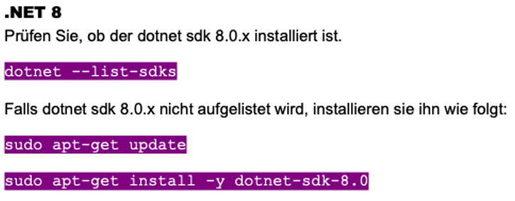

# Projekt M346

## CSV zu JSON Converter mit AWS Lambda

**Inhaltsverzeichnis**

- [Projekt Team](#projekt-team)
- [Einleitung zur Projektdokumentation](#einleitung-zur-projektdokumentation)
- [Vorbereitung](#vorbereitung)
- [Aufbau des Services](#aufbau-des-services)
- [Inbetriebnahme](#inbetriebnahme)
    - [Anforderungen](#anforderungen)
- [Anhang](#anhang)

## Projekt Team

- Timo Aepli
- Matteo Bucher
- Benjamin Nater

## Einleitung zur Projektdokumentation

In diesem Projekt haben wir, Timo Aepli, Matteo Bucher und Benjamin Nater, einen Cloud-Service entwickelt, der CSV-Dateien automatisch in JSON konvertiert. Mithilfe von AWS S3 und Lambda stellen wir die Lösung im AWS Learner Lab bereit. Alle Dateien sowie die gesamte Dokumentation, einschließlich Aufbau, Nutzung und Testergebnisse, haben wir in einem Git-Repository abgelegt.

## Vorbereitung

Zuerst haben wir ein öffentliches Git-Repository erstellt. Danach haben wir eine Aufgabenliste erstellt, in der festgelegt ist, wer was macht.

| Aufgabe | Erledigt bis | Wer | Verantwortlich |
| ----------- | ----------- | ----------- | ----------- |
| Lambda Funktion | 18.12.2024 | alle | Matteo, Benjamin |
| Buckets per Script erstellen CLI-Datei | 18.12.2024 | alle | Matteo, Benjamin |
| Dokumentation | 18.12.2024 | alle | Timo |
| Selbstreflektion | 19.12.2024 | alle | alle |
| Testen | 19.12.2024 | Benjamin | Benjamin |

## Aufbau des Services

## Inbetriebnahme

### Anforderungen

- Unix Betriebssystem (Linux / MacOS)
- .NET 8 &rarr; [.NET 8 Installation](#anhang)
- AWS Learner Lab
- AWS CLI &rarr; [Installation und Konfiguration von AWS CLI](https://gbssg.gitlab.io/m346/iac-aws-cli/ "AWS CLI")
- AWS S3

## Anhang

**.NET 8 Installation**

