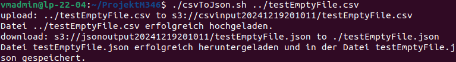

# Projekt M346

## CSV zu JSON Converter mit AWS Lambda

**Inhaltsverzeichnis**

- [Projekt Team](#projekt-team)
- [Einleitung zur Projektdokumentation](#einleitung-zur-projektdokumentation)
- [Vorbereitung](#vorbereitung)
- [Aufbau des Services](#aufbau-des-services)
- [Anwendung](#anwendung)
    - [Anforderungen](#anforderungen)
    - [Inbetriebnahme](#inbetriebnahme)
    - [Nutzung](#nutzung)
- [Test Protokoll](#test-protokoll)
    - [JSON File anstelle vom CSV File](#json-file-anstelle-vom-csv-file)
    - [Leeres CSV File](#leeres-csv-file)
    - [Korruptes CSV File](#korruptes-csv-file)
- [Reflexion](#reflexion)
    - [Benjamin Nater](#benjamin-nater)
    - [Matteo Bucher](#matteo-bucher)
    - [Timo Aepli](#timo-aepli)
- [Quellenverzeichnis](#quellenverzeichnis)

## Projekt Team

- Timo Aepli
- Matteo Bucher
- Benjamin Nater

## Einleitung zur Projektdokumentation

In diesem Projekt haben wir, Timo Aepli, Matteo Bucher und Benjamin Nater, einen Cloud-Service entwickelt, der CSV-Dateien automatisch in JSON konvertiert. Mithilfe von AWS S3 und Lambda stellen wir die Lösung im AWS Learner Lab bereit. Alle Dateien sowie die gesamte Dokumentation, einschließlich Aufbau, Nutzung und Testergebnisse, haben wir in einem Git-Repository abgelegt.

## Vorbereitung

Zuerst haben wir ein öffentliches Git-Repository erstellt. Danach haben wir eine Aufgabenliste erstellt, in der festgelegt ist, wer was macht.

| Aufgabe | Erledigt bis | Wer | Verantwortlich |
| ----------- | ----------- | ----------- | ----------- |
| Lambda Funktion | 18.12.2024 | alle | Matteo, Benjamin |
| Buckets per Script erstellen CLI-Datei | 18.12.2024 | alle | Matteo, Benjamin |
| Dokumentation | 18.12.2024 | alle | Timo |
| Selbstreflektion | 19.12.2024 | alle | alle |
| Testen | 19.12.2024 | Timo | Timo |

## Aufbau des Services

## Anwendung

### Anforderungen

- **Unix-Betriebssystem**  
  Geeignet für Linux und macOS.  

- **AWS Learner Lab**  
  Deine Lernumgebung für Cloud-Technologien.  

- **AWS CLI**  
  [Installation und Konfiguration von AWS CLI](https://gbssg.gitlab.io/m346/iac-aws-cli/ "AWS CLI")  

- **.NET 8**  
    

- **AWS Lambda**  
    

---

### Inbetriebnahme

1. Folgenede Befehle asführen:

    ```
    git clone https://github.com/TimoAepli/ProjektM346.git
    cd ProjektM346
    ./initalize.sh
    ```

---

### Nutzung

## Test Protokoll

Für jeden Test wurde dieselbe Datei verwendet, die für den jeweiligen Test angepasst wurde:
  ```
  Name,Alter,Beruf,Stadt,Land,Gehalt
  Anna,28,Lehrerin,Berlin,Deutschland,45000
  Max,34,Ingenieur,Hamburg,Deutschland,55000
  Lena,29,Designer,Stuttgart,Deutschland,48000
  ```
Folgende Test wurden von Timo Aepli am 19.12.2024 durchgeführt:

### Normales CSV File

Bei diesem Test wurde ein normales CSV File verwendet und erfolgreich konvertiert:


Das JSON File wurd im ProjektM346 Ordner erfolgreich abgelegt:
```
[
  {
    "Name": "Anna",
    "Alter": "28",
    "Beruf": "Lehrerin",
    "Stadt": "Berlin",
    "Land": "Deutschland",
    "Gehalt": "45000"
  },
  {
    "Name": "Max",
    "Alter": "34",
    "Beruf": "Ingenieur",
    "Stadt": "Hamburg",
    "Land": "Deutschland",
    "Gehalt": "55000"
  },
  {
    "Name": "Lena",
    "Alter": "29",
    "Beruf": "Designer",
    "Stadt": "Stuttgart",
    "Land": "Deutschland",
    "Gehalt": "48000"
  }
]
```
Dieser Test konnte in kurzer Zeit erfolgreich abgeschlossen werden.

### CSV mit anderen Delimitern

Bei diesem Test wurden die Kommas im CSV File durch Semikolons ersetzt und erfolgreich konvertiert:


Das JSON wurde korrekt erstellt und sah gleich aus wie beim CSV File mit den Kommas.

### JSON File anstelle vom CSV File

Bei diesem Test wurde ein JSON File anstelle vom CSV File.


Dieser Test ist fehlgeschlagen, was positiv ist. 
In der nächsten Version wird die Fehlermeldung überarbeitet und zurückgegeben, dass nur csv-Dateien konvertiert werden können.

### Leeres CSV File

Bei diesem Test wurde ein leeres CSV File verwendet und erfolgreich konvertiert:


 
Das JSON File hatte nur die beiden eckigen Klammern, was für ein JSON File normal ist:


Somit ist dieser Test ebenfalls erfolgreich abgeschlossen.

### CSV File mit zu vielen Werten

Bei diesem Test wurde ein CSV File verwendet, in welchem es je zwei Werte zu viel hat:
```
Name,Alter,Beruf,Stadt,Land,Gehalt
Anna,28,Lehrerin,Berlin,Deutschland,45000,Wiesenweg,42
Max,34,Ingenieur,Hamburg,Deutschland,55000,Sonnenstrasse,36
Lena,29,Designer,Stuttgart,Deutschland,48000,Haldenweg,3
```
Dieses File wurde ebenfalls konvertiert:


Im Output wurden die überflüssigen Werte entfernt, was somit positiv ist.   
In der nächsten Version wird es noch eine Fehlermeldung geben, dass die überflüssigen Werte gelöscht werden.

### Speicherort der konvertierten Dateien

Alle erfolgreich konvertierten Dateien wurden im ProjektM346 Ordner abgelegt: 


## Reflexion

### Benjamin Nater

### Matteo Bucher

### Timo Aepli

## Quellenverzeichnis

[AWS CLI](https://docs.aws.amazon.com/cli/)

[ChatGPT](https://chatgpt.com/)